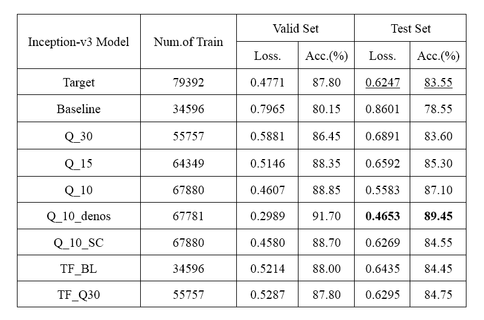
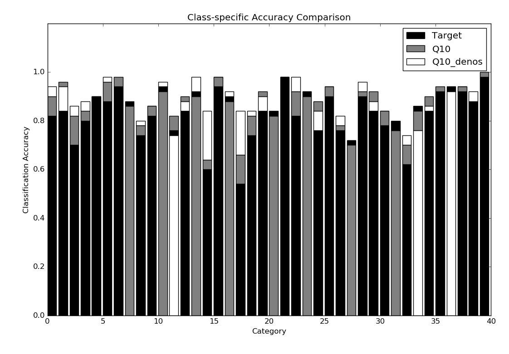
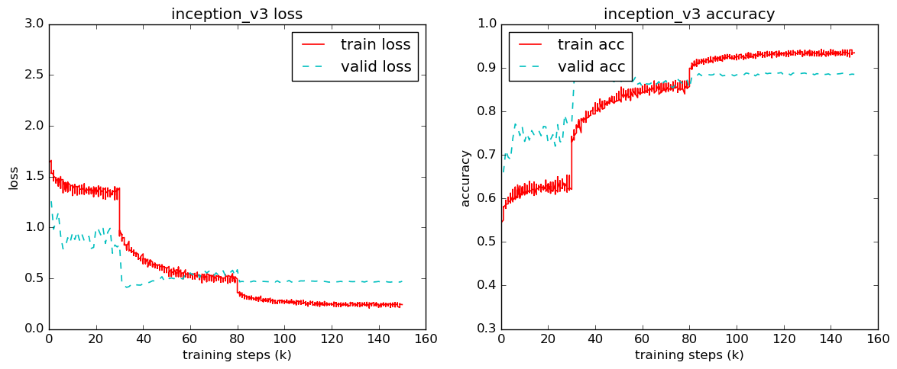
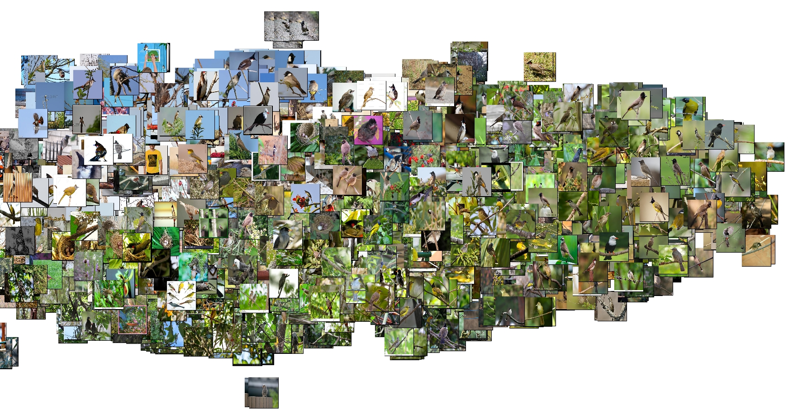

# WebVision

WebVision is an exploratory project which wants to find ways to learn from noisy data.

The process pipeline is as follows:
- Filter data
- Train baseline model
- Extract features and clustering
- Design curriculim learning strategy
- Train models from easy to hard

Please check out [this site](http://www.vision.ee.ethz.ch/webvision/index.html) for dataset details.

## Results

### Comparison of Models

### Comparision of class-specific accuracy

### Precision-Recall Curve

### Training Curve
#### Q10_denos

### Data Visulization

#### (1) Examples in  Tench

#### (2) All images of Bulbul

#### (3) Clean images of Bulbul

#### (4) Noisy images of Bulbul
